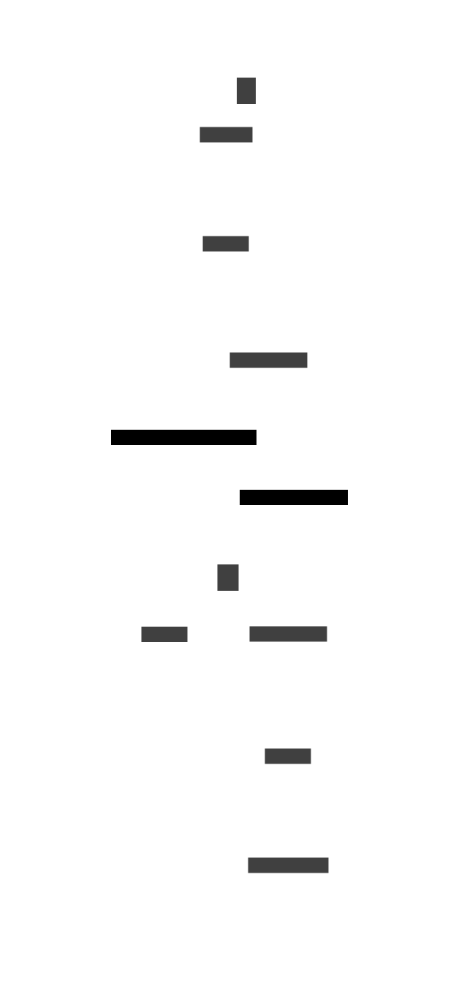

# ReBAC

You can use Relations-Based Access Control (ReBAC) to define and check fine-grained permissions between
entities as a relations graph. Relations graphs enable Ruek to derive implicit relations when there
aren't any direct relations.

For example, in the following relations graph there's no direct relation created between `user:jane`
and `doc:notes.txt`. But by examining the relations, Ruek can derive `user:jane -> reader -> doc:notes.txt`
relation.

## Relation Tuples

A relation, which is a connection between a left entity and a right entity, is represented by a _relation
tuple_. A relation tuple can be expressed using `'['⟨strand⟩']'⟨entity⟩'/'⟨relation⟩'/'⟨entity⟩` text
notation, where;

- `⟨strand⟩` is a _relation_ that links two tuples together which can be empty
- `⟨entity⟩` is a _principal_ or an outside entity with a _type_ and an _id_
- `⟨relation⟩` is a string describing the _relation_ between the two entities

| Text notation | Semantics |
| ------------- | --------- |
| `[]user:alice/member/team:writers`        | User `user:alice` is a _member_ of `team:writers`            |
| `[member]team:writers/edit/doc:notes.txt` | _Members_ of `team:writers` can _edit_ `doc:notes.txt`       |
| `[owner]folder:F/owner/doc:notes.txt`     | _Owners_ of `folder:F` are also _owners_ of `doc:notes.txt`  |
| `[]folder:F/parent/doc:notes.txt`         | Entity `folder:F` has a _parent_ relation to `doc:notes.txt` |

Two or more relation tuples can be linked (left to right) using a _strand_. To be able to link two tuples
and consider them to in a single relations chain,

1. First tuple's _right entity_ must match the second tuple's _left entity_ (`t1.right == t2.left`)
2. And, first tuple's _relation_ must match second tuple's _strand_ (`t1.relation == t2.strand`)

For example, `[]user:alice/member/team:writers` can be chained with `[member]team:writers/edit/doc:notes.txt`
but not with `[owner]team:writers/edit/doc:notes.txt` (since first tuple's _relation_, `member`, doesn't
match second tuple's _strand_, `owner`).

Example - Two tuples linked by a strand

## Strategies

ReBAC gives you a significant amount of flexibility to define fine-grained permissions but depending
on how complex your relations graph is, there can be read/write bottlenecks.

For example, let's consider the following relation tuples.

- `[]user:jane/member/group:writers`
- `[member]group:writers/member/group:readers`
- `[member]group:readers/reader/doc:notes.txt`
- `group:writers` has `writer` relation to 10K documents

To derive the relation `[]user:jane/reader/doc:notes.txt` using a BFS[^bfs] graph traversal algorithm
(which has **O(v+e)** complexity), we will need to read 10,003 tuples. This can be really slow depending
on DB load and number of concurrent requests.

> [!TIP]
> This is only an illustrative example. In reality, Ruek traverse the relations graphs from right
> to left which will result in only 3 reads in this instance.

In order to maintain a consistent and a predictable throughput (QPS), Ruek offers different optimisation
strategies to suite different shapes of relations graphs.

### Direct

> [!TIP]
> Best for reads (**O(1)**), _can be_ worst for writes (**O(1+l+r)**).

_Direct_ strategy optimise for **O(1)** relations checks at the expense of computing and storing derived
relations during creation.

For example if the following tuples are created sequencially, when creating `t2` Ruek will evaluate
the relations graph and compute and store the derived tuple `t2-1`. This ensures
`user:jane -> parent -> group:viewers` relations check can be performed with just one lookup.

| Id     | Strand |  Left Entity  | Relation | Right Entity  | Computed |
| ------ | ------ | ------------- | -------- | ------------- | :------: |
| `t1`   |        | user:jane     | member   | group:editors |          |
| `t2`   | member | group:editors | parent   | group:viewers |          |
| `t2-1` |        | user:jane     | parent   | group:viewers |    ✓     |

### Graph

> [!TIP]
> Best for writes (**O(1)**), _can be_ worst for reads (**O(1+v+e)**).

_Graph_ strategy does not perform any additional computations when creating relations resulting in **O(1)**
writes. When checking relations, if a direct relation does not exists Ruek will use a graph traversal
algorithm to compute and check derived tuples which can result in slow reads depending on the complexity
of the relations graph.

### Set

> [!TIP]
> A balance between reads and writes (**O(1+n+m)**), best for large datasets.

_Set_ strategy require relations to be defined between principals (e.g. users, groups) and entities.
When creating relations, Ruek will analyse the relations graph and compute and store derived relations
between principals if necessary. This enables Ruek to use a set intersection algorithm (we call it _spot_)
to efficiently check relations with **O(1+n+m)** complexity.

Consider the following tuples created sqeuncially.

| Id     | Strand |  Left Entity  | Relation | Right Entity  | Computed |
| ------ | ------ | ------------- | -------- | ------------- | :------: |
| `t1`   |        | user:jane     | member   | group:writers |          |
| `t2`   | member | group:writers | member   | group:readers |          |
| `t2-1` |        | user:jane     | member   | group:readers |    ✓     |
| `t3`   | member | group:readers | reader   | doc:notes.txt |          |
| `t4`   | owner  | folder:home   | parent   | doc:notes.txt |          |
| `t5`   |        | user:jane     | owner    | folder:home   |          |

When `t2` is created, similar to direct strategy, Ruek compute and store the derived tuple `t2-1`.
However when `t3`, `t4` and `t5` are created although they are part of the same relations graph, Ruek
does not store any additional derived tuples.

This is because when Ruek evaluates the relations graph left to right, it can identify `t2`'s left
and right entities are principals and storing the derived tuple `t2-1` will optimise reads. However
while `t3` and `t5`'s left entities are principals their right entities are not, so storing additional
derived tuples would increase writes. `t4`'s left and right entities are not principals so Ruek doesn't
consider it for any further optimisations when using set strategy.

When checking if `user:jane -> reader -> doc:notes.txt` relation exists using set strategy, Ruek
look for all the groups `user:jane` is a member of and compare that list with all the groups that has
a `reader` relation to `doc:notes.txt` using the _spot_ algorithm.

[^bfs]: [Breadth-first search](https://en.wikipedia.org/wiki/Breadth-first_search)
